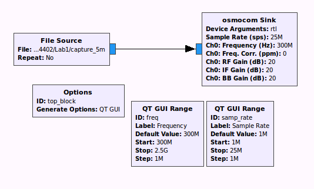

# Questions lab 1

### Question 1 
*Research the frequencies of the ISM bands, and describe where you would expect
to find the signal, given the properties of radio waves at these particular and 
the typical use case of garage door opener. At which frequencies do you not 
expect to find the signal? Explain why.*

[wiki ISM bands](https://en.wikipedia.org/wiki/ISM_band)

[wiki short range devices](https://en.wikipedia.org/wiki/Short_Range_Devices)

[wiki garage door opener](https://en.wikipedia.org/wiki/Garage_door_opener)

The wiki says that garage door openers are between 300-400 MHz, so the ISM band
closest to that is the 433.05-434.79 MHz. The frequency of the signal should
not be to high to limit power usage, and to allow the signal to go through
walls. On the other hand, a signal with a very low frequency can be picked up
from afar, so the signal should be high enough to limit the range.

### Question 2
*Analyze the signal in the time and frequency domain, and describe your 
observations. What can you conclude about the signal’s modulation? Record the 
frequency and bandwidth of the signal for later processing.*

There are power intensity changes at 433 MHz when pressing a button on the 
garage door opener. This implies that Amplitude Modulation is used. In the 
time domain this is very well visible. Because we see only a 'zero' level and 
a 'high' level, On-Of-Keying must be the used method of amplitude modulation. 

The grey line in the image below shows a 'max hold' of the signal, where it 
can be seen that the signal from the key is visible in the band of 431-437 MHz,
so the bandwidth is 6 MHz.

### Question 3 
*Demodulate the signal based on the modulation type
you identified earlier and study the signal. What information is
transmitted by the garage door remote?*

The garage door remote sends a predefined bitsequence: 
1011001111001010000010000 (or inverted, depending on whether a 'long' is a one 
or a zero). 
There is a bit sequence for opening and a bit sequence for closing the door, so
the only information that is sent is the command.

### Question 4 
*Compare each of the transmissions, describe how
does the protocol of the wireless remote works. What triggers the
garage door to open and close?*

The protocol is a one-way communication from the garage door opener to the 
garage door.
The garage door opener sends a predefined bitsequence for opening or closing 
the garage door. Depending on which of the two bitsequences is received by 
the garage door, it will react by opening or closing.

### Question 5 
*Assemble a signal that is able to open the garage
door and transmit it. Ensure that the “garage door” opens.*

The garage door can be opened by sending recorded data containing the predefined 
bitsequence. We are using osmocom sink to send the data as shown in the following 
schema:

### Question 6
*Describe the weakness of the garage door opener
protocol. How would you change the communication protocol
so that the basic signal injection you have just done would no
longer be successful? What would be necessary for the designers
to accomplish this. Aside from the cryptographic and network-
security related aspects, also comment on usability aspects of
your proposed solution.*

The weakness of the garage door opener is that there is no way to verify that
the sender of the 'open' or 'close' command is the garage door opener.
A method of implementing some security is to use a shared key or key pair, 
where the garage door opener has one key, and the garage door receiver has the 
other. 
Whenever the garage door receiver receives an 'open' or 'close' command, it will
send out a random sequence that has to be sent back encrypted. Only the garage
door opener can encrypt (sign) this sentence such that the garage door receiver 
can decrypt it. When the garage door has received the sequence with the correct
signature, it will execute the received command.

### Question 7 
*Given the chart, estimate the beamwidth of the antenna. What range extension 
would you expect in boresight?*

The beamwidth, i.e., the angle between the two half-power ($-3dB$) points closest to the boresight axis of the antenna, is already shown in figure 5 as purple lines in the lab assignment. Here can be seen that the beamwidth is approximately $\frac{7}{9} * 90^{\circ} = 70^{\circ}$ 

The antenna gives, in boresight, a gain of $8dB$. This extra power is lost because of the free-spaca path loss (FSPL):

$$ FSPL = {\left(\frac{4 \pi d}{\lambda}\right)}^2 = {\left(\frac{4 \pi d f}{c}\right)}^2$$

Here $f$ is the frequency, $d$ the distance, $\lambda$ the wave length and $c$ the speed of light. Now we want to expres the FSPL in $dB$ by doing $FSPL_{dB} = 10*\log_{10}{(FSPL)}$. Now follows:

$$ FSPL_{dB} = 10*\log_{10}{\left({\left(\frac{4 \pi d f}{c}\right)}^2\right)} = 20*\log_{10}{\left({\frac{4 \pi d f}{c}}\right)}$$

$$ FSPL_{dB} = 20*\log_{10}\left(d\right) + 20*\log_{10}\left(f\right) + 20*\log_{10}\left(\frac{4 \pi}{c}\right)$$

$$ FSPL_{dB} = 20*\log_{10}\left(d\right) + 20*\log_{10}\left(f\right) - 147.55$$

Now we re-order the equation and obtain the following:

$$ 20*\log_{10}\left(d\right) = FSPL_{dB} -  20*\log_{10}\left(f\right) + 147.55$$

$$ \log_{10}\left(d\right) = \frac{FSPL_{dB}}{20} - \log_{10}\left(f\right) + 7.3775$$

$$ d = \frac{1}{f} * 10^{ 7.3775 + \frac{FSPL_{dB}}{20}}$$

with $d$ the distance in meters. When we fill in this equation using $f=433 MHz$ and $FSPL_{dB}=8 dB$ we obtain $d = 0.138m$. Note that when the distance is zero one of the following things need to hold: $f = \infty$ or $FSPL = 0$ or $FSPL_{dB} = -\infty$.

SOURCES: [link](https://en.wikipedia.org/wiki/Free-space_path_loss), [link](https://en.wikipedia.org/wiki/Beamwidth).

### Question 8
*Plot a chart of distance versus signal strength ob-
served by the SDR. Mark when the garage door stops to react
to the signals sent by the remote. When can the SDR no longer
receive and decode the transmission? Mark this threshold in the
chart as well.*

When answering the question, no garage door opener was available. 
For that reason we tried a Nissan car key ([frequencies: 301.5 MHz, 
302.5 MHz, 315MHz, 433MHz](http://www.sigidwiki.com/wiki/Nissan_Car_Key)),
but we received only noise on those frequencies. 

The chart would be created by measuring the power of the signal at increasing
distances. This power can be found in the 'time domain' tab when running the 
scan with the *gnuradio-companion* program.
Marking at what distance the garage door (or in our case, car door) would stop
responding can trivially found by trying to open/close the door at increasing
distances.

### Question 9 
*Based on the approximate receiver sensitivity of the
garage door, estimate from how far away an adversary could
successfully observe and inject a signal only based on antenna
gain.*

Based on the use case of a garage door opener, we expect that the signal will have a range of approximally 20 meters. Especially because the signal might have same losses due to the window of the car and the garage deur it needs to go through.
